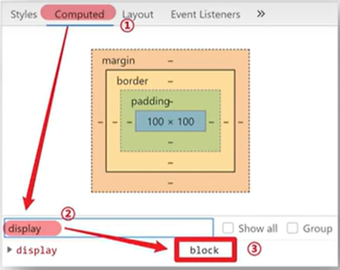
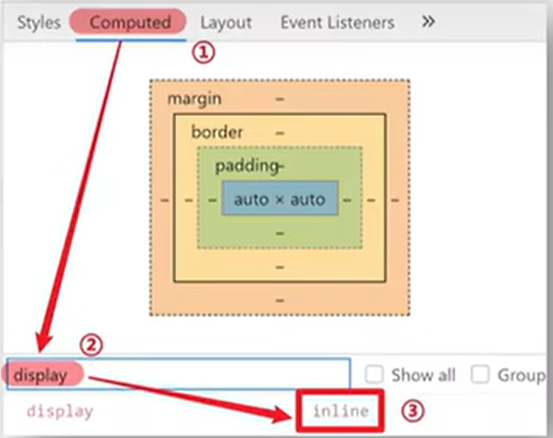

# 选择器进阶

## 学习路径

1. 复合选择器
2. 并集选择器
3. 交集选择器
4. hover伪类选择器
5. Emmet语法

## 复合选择器

### 后代选择器：空格

作用：根据HTML标签的嵌套关系，选择父元素 **后代中** 满足条件的元素

选择器语法：选择器1 选择器2 {css}

结果：

- 在选择器1所找到标签的后代（儿子、孙子、重孙子…..）中，找到满足选择器2的标签，设置样式

注意点：

1. 后代包括：儿子、孙子、重孙子……
2. 后代选择器中，选择器与选择器之间通过 **空格** 隔开

```css
div p {
	color: red;
}
```

### 子代选择器：>

作用：根据HTML标签的嵌套关系，选择父元素 **子代中** 满足条件的元素

选择器语法：选择器1 > 选择器2 {css}

结果：

- 在选择器1所找到标签的子代（儿子）中，找到满足选择器2的标签，设置样式

注意点：

1. 子代只包括：儿子
2. 子代选择器中，选恶气与选择器之间通过 **>** 隔开

```css
div > a {
	color: red;
}
```

## 并集选择器：，

作用：同时选择多组标签，设置相同的样式

选择器语法：选择器1 ， 选择器2 {}

```css
p,div,span,h1 {
	color: red;
}
```

## 交集选择器：紧挨着，用.连接

作用：选中页面中 **同时满足** 多个选择器的标签
选择器语法：选择器1.选择器2 {}

结果：

- （既又原则）找到页面中 **既** 能被选择器1选中，**又** 能被选择器2选中的标签，设置样式

## hover伪类选择器

作用：选中鼠标**悬停**在元素上的**状态**，设置样式

选择器语法：选择器:hover {}

注意点：

1. 伪类选择器选中的元素的**某种状态**

## Emmet语法

作用：通过间歇语法，快速生成代码

语法：

- 类似于刚刚学习的选择器的写法

- vscod自带功能

# 背景相关属性

## 背景颜色

属性名：**background-color**（bgc）

属性值：

- 颜色取值：关键字、rgb表示法、rgba表示法、十六进制

注意点：

- 背景颜色默认值是**透明**：rgba(0,0,0,0)、transparent
- 背景颜色不会影响盒子大小，并且还能看清盒子的大小和位置，一般在布局中会习惯先给盒子设置背景颜色

## 背景图片

属性名：**background-image**（bgi）

属性值：background-image：url（‘图片的路径’）;

注意：

- 背景图片中url中可以省略引号
- 背景图片默认是在水平和垂直方向平铺的
- 背景图片仅仅是装饰作用

## 背景平铺

属性名：**background-repeat**（bgr）

属性值：

| 取值      | 效果                           |
| --------- | ------------------------------ |
| repeat    | （默认值）水平和垂直方向都平铺 |
| no-repeat | 不平铺（最常用）               |
| repeat-x  | 沿着水平方向（x轴）平铺        |
| repeat-y  | 沿着垂直方向（y轴）平铺        |

## 背景位置

属性值：**background-position**（bgp）

属性值：background-position：水平方向位置，垂直方向位置;

1. 方位名词（最多只能表示9个位置）：
    - 水平方向：left/center/right
    - 垂直方向：top/center/bottom
2. 数字+px（坐标）：
    - 坐标系：
        - 原点（0,0）：盒子的左上角
        - x轴：水平向右
        - y轴：垂直向下
    - 操作：将图片左上角与坐标点重合即可

注意点：

- 方位名词取值和坐标取值可以混使用，第一个取值表示水平，第二个取值表示垂直

## 背景相关属性连写

属性名：background（bg）

属性值：

- 单个属性值的合写，取值之间以空格隔开

书写顺序：

- 推荐：background：color image repeat position(顺序无规定)

省略问题：

- 可以按照需求省略
- 特殊情况：在pc端，如果盒子大小和背景图片大小一样，此时可以直接写background：url()

注意点

- 如果需要设置单独的样式和连写
- ①要么把单独的样式写在连写的下面
- ②要么把单独的样式写在连写的里面

## （拓展）img标签和背景图片的区别

需求：需要在网页中展示一张图片的效果

方法一：直接写上img标签即可

- img标签是一个标签，不设置宽高默认会以原尺寸显示

方法二：div标签+背景图片

- **需要设置div的宽高**，因为背景图片只是装饰的CSS样式，不能撑开div标签

# 元素显示模式

## 学习路径

1. 块级元素
2. 行内元素
3. 行内块元素
4. 元素显示模式转换

## 块级元素

显示特点：

1. 独占一行（一行只能显示一个）
2. 宽度默认是父元素的宽度，高度默认由内容撑开
3. 可以设置宽高

代表标签：

- **div、p、h系列**、ul、li、dl、dt、dd、from、header、nav、footer……



## 行内元素

显示特点：

1. 一行可以显示多个
2. 宽度和高度默认由内容撑开
3. 不可以设置宽高

代表标签：

- **a、span**、b、u、i、s、strong、ins、em、del…..



## 行内块元素

显示特点：

1. 一行可以显示多个
2. 可以设置宽高

代表标签：

- **input、textarea**、button、select……
- 特殊情况：img标签由行内块元素特点，但是Chrome调试工具中显示结果是inline

## 元素显示模式转换

目的：改变元素默认的显示特点，让元素复合布局要求

语法：

| 属性                 | 效果             | 使用频率 |
| -------------------- | ---------------- | -------- |
| display:block        | 转换成块级元素   | 较多     |
| display:inline-block | 转换成行内块元素 | 较多     |
| display:inline       | 转换成行内元素   | 极少     |

## 拓展1：HTML嵌套规范注意点

1. 块级元素一般作为大容器，可以嵌套：文本、块级元素、行内元素、行内块元素等等……
    - 但是：p标签中不要嵌套div、p、h等块级元素
2. a标签内部可以嵌套任意元素
    - 但是：a标签不能嵌套a标签

# CSS特性

## 学习路径

1. 继承性
2. 层叠性

## 继承性

### 介绍

特性：子元素有默认继承父元素央视的特点（子承父业）

可以继承的常见属性（文字控制属性都可以继承）

1. color
2. font-style、font-weight、font-size、font-family
3. text-indent、text-align
4. line-height
5. ……

注意点：

- 可以通过调试工具判断样式是否可以继承

### （拓展）继承失效的特殊情况

如果元素有浏览器默认样式，此时继承性依然存在，但是优先显示浏览器的默认样式

1. a标签的color会继承失效
2. h系列标签的font-size会继承失效

## 层叠性

### 介绍

当样式冲突时，只有当选择器优先级相同时，才能通过层叠性判断结果